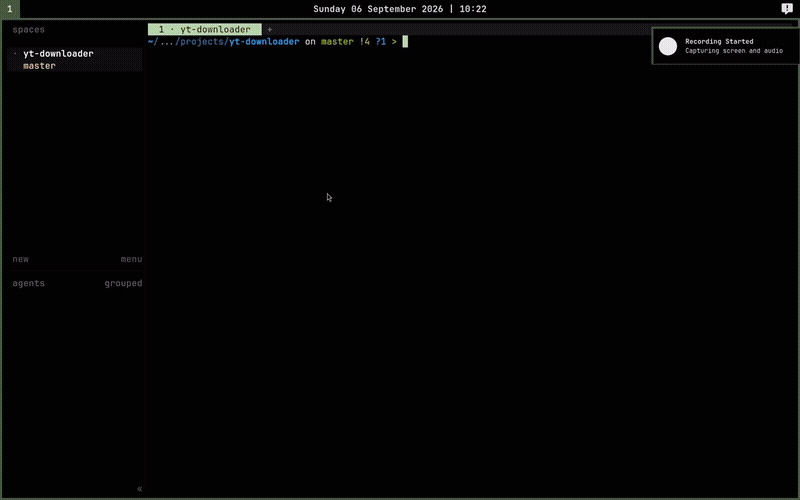

# yt-downloader

Cross-platform media downloader GUI built with Python, PyQt5, and yt-dlp.

<p align="center">
  
</p>

## Setup

Requires Python >= 3.14 and ffmpeg (for audio conversion).

```sh
git clone https://github.com/RahulSandhu/yt-downloader.git
cd yt-downloader
python -m venv .venv
source .venv/bin/activate
pip install -r requirements.txt
```

## Usage

Run the application during development:

```sh
make run
```

Equivalent to:

```sh
PYTHONPATH=src .venv/bin/python -m yt_downloader.main
```

Paste a URL (YouTube, Twitter, Instagram, TikTok, etc.), choose audio-only or
video, edit the title and artist and optionally fetch cover art, then pick a
destination folder and file name to save. Audio is saved as `m4a`, video as
`mp4`.

## Disclaimer

This project is intended for **educational purposes only**. The software is
provided as a demonstration of media-downloading technology and should not be
used to download or distribute copyrighted content without the explicit
permission of the copyright holder. Users are solely responsible for ensuring
their usage complies with all applicable laws and the terms of service of any
website they access. The author assumes no liability for any misuse of this
software.
